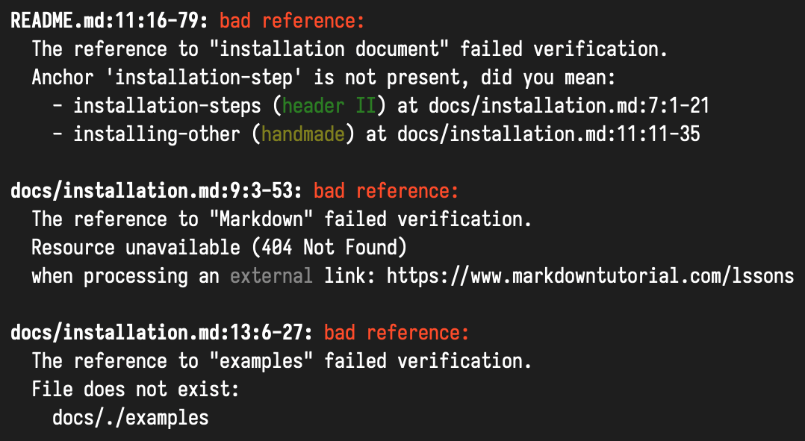

<!--
 - SPDX-FileCopyrightText: 2018-2021 Serokell <https://serokell.io>
 -
 - SPDX-License-Identifier: MPL-2.0
 -->

# Xrefcheck


Xrefcheck is a tool for verifying local and external references in a repository's documentation that is quick, easy to setup, and suitable to be run on a CI pipeline.



## Motivation [↑](#xrefcheck)

As a project evolves, links in markdown documentation have a tendency to become broken. This is usually because:
1. A file has been moved;
2. A markdown header has been renamed;
3. An external site has ceased to exist.

This tool will help you to keep references in order.
You can run `xrefcheck` continuously in your CI pipeline,
and it will let you know when it finds a broken link.

## Aims [↑](#xrefcheck)

Comparing to alternative solutions, this tool tries to achieve the following points:

* Quickness
  * References are verified in parallel.
  * References with the same target URI are only verified once.
  * It first attempts to verify external links with a `HEAD` request; only when that fails does it try a `GET` request.
* Resilience
  * When you have many links to the same domain, the service is likely to start replying with "429 Too Many Requests".
    When this happens, `xrefcheck` will wait the requested amount of seconds before retrying.
* Easy setup - no extra actions required, just run `xrefcheck` in the repository root.
* Conservative verifier allows using this tool in CI, no false positives (e.g. on sites which require authentication) should be reported.

## Features [↑](#xrefcheck)

* Supports both GitHub and GitLab flavored markdown.
* Supports Windows and Unix systems.
* Supports relative and absolute local links.
* Supports external links (`http`, `https`, `ftp` and `ftps`).
* Detects broken and ambiguous anchors in local links.
* Integration with GitHub Actions.

## Dependencies [↑](#xrefcheck)

Xrefcheck requires you to have `git` version 2.18.0 or later in your PATH.

## Usage [↑](#xrefcheck)

We provide the following ways for you to use xrefcheck:

- [GitHub Actions](https://github.com/marketplace/actions/xrefcheck)
- [Statically linked binaries](https://github.com/serokell/xrefcheck/releases)
- [Docker image](https://hub.docker.com/r/serokell/xrefcheck)
- [Building from source](#build-instructions-)
- Nix
  ```
  nix shell -f https://github.com/serokell/xrefcheck/archive/master.tar.gz -c xrefcheck
  ```

If none of those are suitable for you, please open an issue!

To find all broken links in a repository, simply run `xrefcheck` from its root folder:

```sh
xrefcheck
```

To also display a list of all links and anchors:

```sh
xrefcheck --verbose
```

For description of other options:

```sh
xrefcheck --help
```

To configure `xrefcheck`, run:

```sh
xrefcheck dump-config --type GitHub
```

This will create a `.xrefcheck.yaml` file with all the configuration
options, [here's an example](tests/configs/github-config.yaml).
This file should be committed to your repository.

## Build instructions [↑](#xrefcheck)

Run `stack install` to build everything and install the executable.
If you wish to use `cabal`, you need to run [`stack2cabal`](https://hackage.haskell.org/package/stack2cabal) first!

### Run on Windows [↑](#xrefcheck)

On Windows, executable requires some dynamic libraries (DLLs).
They are shipped together with executable in [releases page](https://github.com/serokell/xrefcheck/releases).
If you have built executable from source using `stack install`,
those DLLs are downloaded by stack to a location that is not on `%PATH%` by default.
There are several ways to fix this:
- Add `%LocalAppData%\Programs\stack\x86_64-windows\msys2-<...>\mingw64\bin` to your PATH
- run `stack exec xrefcheck.exe -- <args>` instead of `xrefcheck.exe <args>`
- add DLLs from archive from releases page to a folder containing `xrefcheck.exe`

## FAQ [↑](#xrefcheck)

1. How do I ignore specific files?
    * To ignore a specific file, you can either use the `--ignore <glob pattern>` command-line option,
    or the `ignore` list in the config file. Links _to_ those files will be reported as errors, links _from_ those files will not be verified.

1. How do I ignore specific links?
    * Add an entry to the `ignoreLocalRefsTo` or `ignoreExternalRefsTo` lists in the config file.
    * Alternatively, add a `<!-- xrefcheck: ignore link -->` annotation before the link:
      ```md
      <!-- xrefcheck: ignore link -->
      Link to some [invalid resource](https://fictitious.uri/).
      ```
      ```md
      A [valid link](https://www.google.com)
      followed by an <!-- xrefcheck: ignore link --> [invalid link](https://fictitious.uri/).
      ```
    * You can also use a `<!-- xrefcheck: ignore paragraph -->` annotation to ignore all links in a paragraph.

1. How do I ignore all links from a specific markdown file?
    * Add a glob pattern to the `ignoreRefsFrom` list in the config file.
    * Or add a `<!-- xrefcheck: ignore all -->` at the top of the file.

1. How do I ignore all external links?
    * If you wish to ignore all http/ftp links, you can use `--mode local-only`.

1. How does `xrefcheck` handle links that require authentication?
    * It's common for projects to contain links to protected resources.
      By default, when `xrefcheck` attempts to verify a link and is faced with a `403 Forbidden` or a `401 Unauthorized`, it assumes the link is valid.
    * This behavior can be disabled by setting `ignoreAuthFailures: false` in the config file.

1. How does `xrefcheck` handle redirects?
    * The rules from the default configuration are as follows:
      * Permanent redirects (i.e. 301 and 308) are reported as errors.
      * There are no rules for other redirects, except for a special GitLab case, so they are assumed to be valid.
    * Redirect rules can be specified with the `externalRefRedirects` parameter within `networking`, which accepts an array of
      rules with keys `from`, `to`, `on` and `outcome`. The rule applied is the first one that matches with
      the `from`, `to` and `on` fields, if any, where
      * `from` is a regular expression, as in `ignoreExternalRefsTo`, for the source link in a single redirection step. Its absence means that
        every link matches.
      * `to` is a regular expression for the target link in a single redirection step. Its absence also means that every link matches.
      * `on` accepts `temporary`, `permanent` or a specific redirect HTTP code. Its absence also means that
        every response code matches.
      * The `outcome` parameter accepts `valid`, `invalid` or `follow`. The last one follows the redirect by applying the
        same configuration rules.

      For example, this configuration forbids 307 redirects to a specific domain and makes redirections from HTTP to HTTPS to be followed:

      ```
      externalRefRedirects:
        - to: "https?://forbidden.com.*"
          on: 307
          outcome: invalid
        - from: "http://.*"
          to: "https://.*"
          outcome: follow
      ```

      The first one applies if both of them match.

    * The number of redirects allowed in a single redirect chain is limited and can be configured with the
      `maxRedirectFollows` parameter, also within `networking`. A number smaller than 0 disables the limit.

1. How does `xrefcheck` handle localhost links?
    * By default, `xrefcheck` will ignore links to localhost.
    * This behavior can be disabled by removing the corresponding entry from the `ignoreExternalRefsTo` list in the config file.

## Further work [↑](#xrefcheck)

- [ ] Support link detection in different languages, not only Markdown.
  - [ ] Haskell Haddock is first in turn.

## A comparison with other solutions [↑](#xrefcheck)

* [linky](https://github.com/mattias-p/linky) - a well-configurable verifier written in Rust, scans one specified file at a time and works well with system utilities like `find`.
  This tool requires some configuring before it can be applied to a repository or added to CI.
* [awesome_bot](https://github.com/dkhamsing/awesome_bot) - a solution written in Ruby that can be easily included in CI or integrated into GitHub.
  Its features include duplicated URLs detection, specifying allowed HTTP error codes and reporting generation.
  At the moment of writing, it scans only external references and checking anchors is not possible.
* [remark-validate-links](https://github.com/remarkjs/remark-validate-links) and [remark-lint-no-dead-urls](https://github.com/davidtheclark/remark-lint-no-dead-urls) - highly configurable JavaScript solution for checking local and external links respectively.
  It is able to check multiple repositories at once if they are gathered in one folder.
  Doesn't handle "429 Too Many Requests", so false positives are likely when you have many links to the same domain.
* [markdown-link-check](https://github.com/tcort/markdown-link-check) - another checker written in JavaScript, scans one specific file at a time.
  Supports `mailto:` link resolution.
* [url-checker](https://github.com/paramt/url-checker) - GitHub Action which checks external links in specified files.
  Does not check local links.
* [linkcheck](https://github.com/filiph/linkcheck) - advanced site crawler, verifies links in `HTML` files. There are other solutions for this particular task which we don't mention here.

At the moment of writing, the listed solutions don't support ftp/ftps links.

## Issue tracker [↑](#xrefcheck)

We use GitHub issues as our issue tracker.
You can login using your GitHub account to leave a comment or create a new issue.

## For Contributors [↑](#xrefcheck)

Please see [CONTRIBUTING.md](/.github/CONTRIBUTING.md) for more information.

## About Serokell [↑](#xrefcheck)

Xrefcheck is maintained and funded with ❤️ by [Serokell](https://serokell.io/).
The names and logo for Serokell are trademark of Serokell OÜ.

We love open source software! See [our other projects](https://serokell.io/community?utm_source=github) or [hire us](https://serokell.io/hire-us?utm_source=github) to design, develop and grow your idea!
